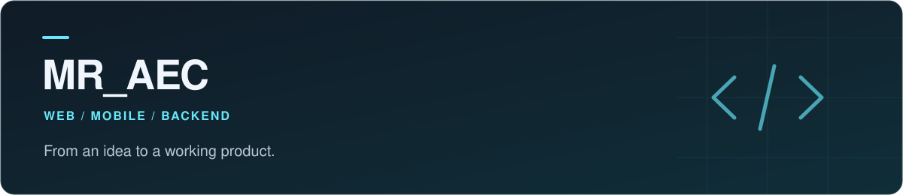

I build web platforms, mobile apps, and the systems behind them.

<a href="https://github.com/MrAec?tab=repositories">Explore repositories &rarr;</a>

## About me

I'm **MR_AEC**, a software developer working across web, mobile, and backend development. I enjoy connecting the pieces of a product: the interface people use, the APIs that power it, and the tools that keep it running.

## What I build

<table>
<tr>
<td width="50%" valign="top">

<strong>Web platforms</strong> 
Management dashboards, web applications, and interactive experiences designed around real workflows.

</td>
<td width="50%" valign="top">

<strong>Mobile apps</strong> 
Android applications with Kotlin, plus mobile projects built with React Native and Flutter.

</td>
</tr>
<tr>
<td width="50%" valign="top">

<strong>Backend systems</strong> 
REST APIs, database operations, and service integrations using Java, Spring Boot, Node.js, and PHP.

</td>
<td width="50%" valign="top">

<strong>Practical automation</strong> 
Scheduled jobs, server workflows, and Python tools that simplify repetitive tasks.

</td>
</tr>
</table>

## My toolkit

<table>
<tr>
<td width="50%" align="center">
 
<strong>Backend &amp; Languages</strong>
  

  
Java / Spring Boot / Node.js / JavaScript / PHP / Python
  
</td>
<td width="50%" align="center">
 
<strong>Web &amp; Mobile</strong>
  

  
React Native / Kotlin / Flutter / Dart / HTML / CSS
  
</td>
</tr>
<tr>
<td width="50%" align="center">
 
<strong>Development Tools</strong>
  

  
Git / GitHub / VS Code / Android Studio
  
</td>
<td width="50%" align="center">
 
<strong>Data &amp; Infrastructure</strong>
  

  
MySQL / Linux / AWS / Cloudflare
  
</td>
</tr>
</table>

 

<samp>IDEA &nbsp;/&nbsp; CODE &nbsp;/&nbsp; PRODUCT</samp>

  

<strong>Build something useful. Then make it better.</strong>

